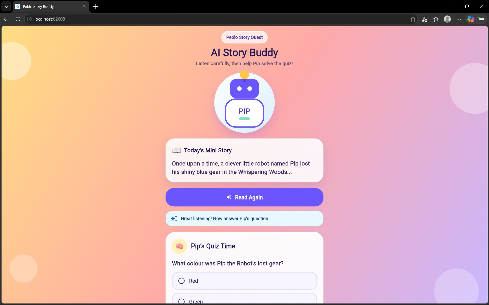
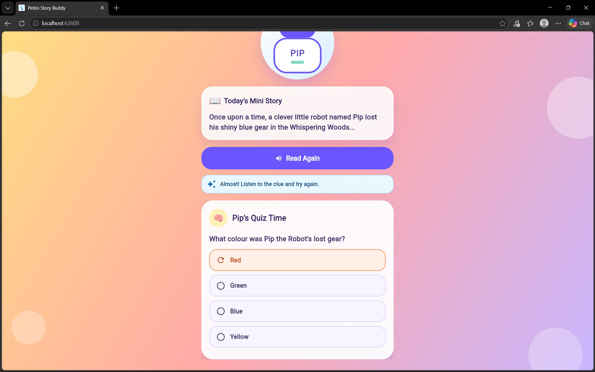
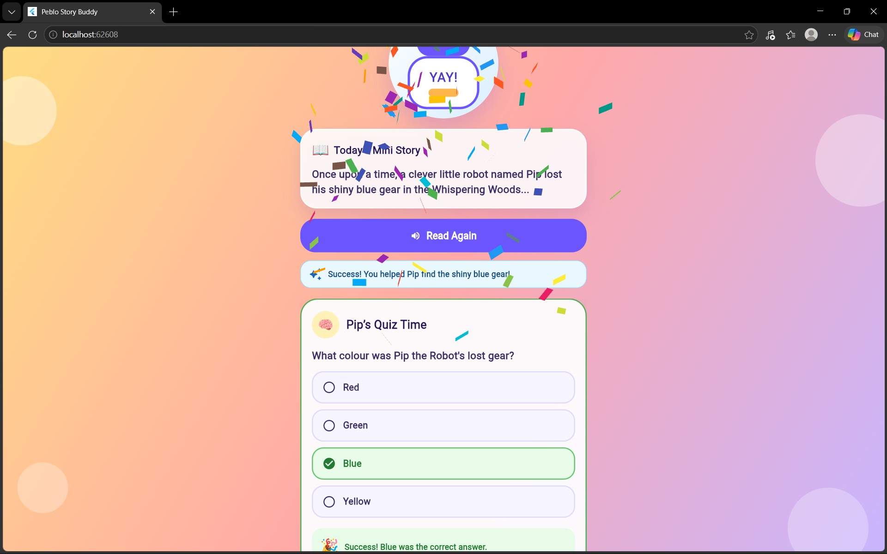

## Screenshots

### Home Screen

### Wrong Answer Feedback

### Success State

---

## Demo Video

Screen Recording:

https://drive.google.com/file/d/1_-dGTmsMkL76dHXcb1eZivRt3dCgiGpJ/view?usp=drive_link

The video demonstrates:

* App launch
* Story narration
* Quiz reveal after narration
* Wrong answer feedback
* Correct answer selection
* Success celebration with confetti

---

## Repository

GitHub Repository:

https://github.com/bellana-upendra/mobile_app_developer_challenge

---

## Challenge Completion Checklist

✅ Kid-friendly UI

✅ Native Text-to-Speech narration

✅ Audio loading and completion states

✅ Data-driven quiz rendering

✅ Wrong-answer feedback (shake + retry)

✅ Success state with confetti

✅ Provider state management

✅ Lightweight implementation for mid-range Android devices

✅ README documentation

✅ Screen recording included

✅ GitHub repository submitted
